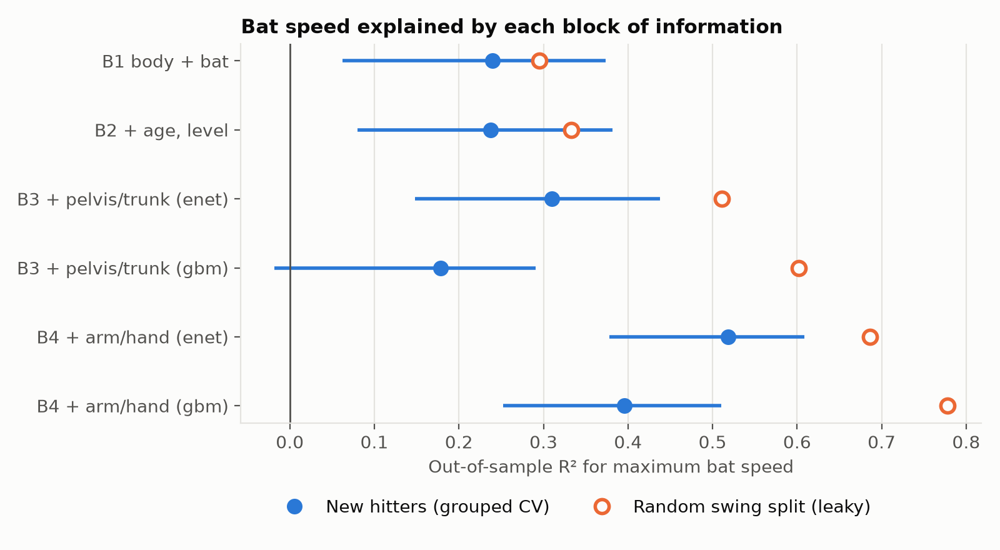
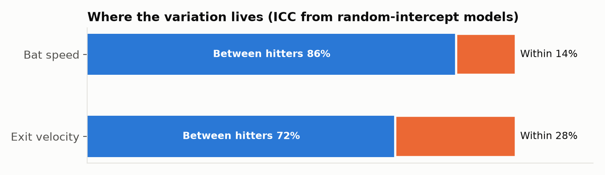
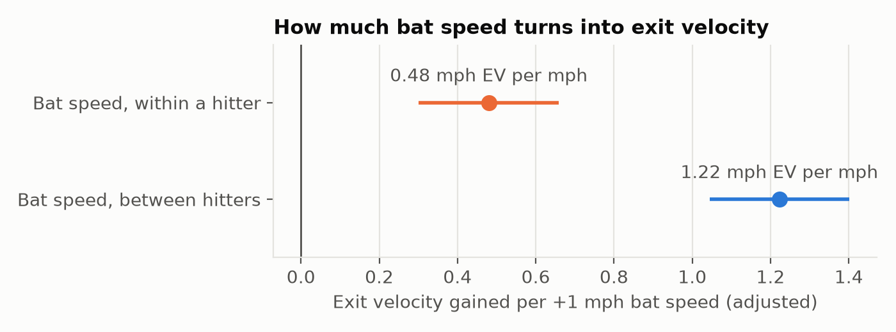
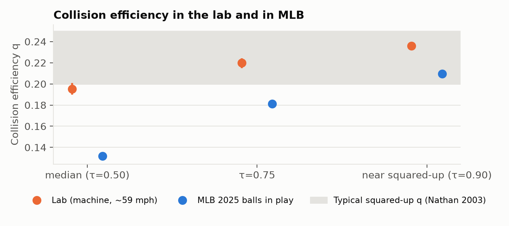
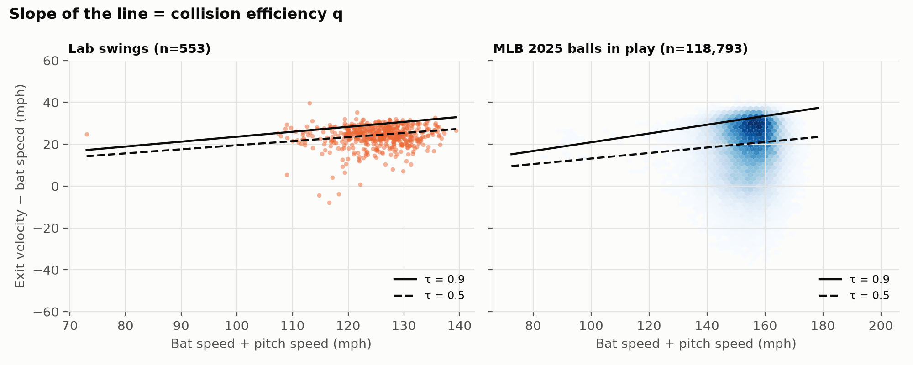

# Where does bat speed come from, and how much of it becomes exit velocity?

**What it is:** a pre-registered biomechanics analysis of 677 swings from 98 hitters (OpenBiomechanics Project, Driveline Baseball). It asks:
- How much of a hitter's bat speed can be predicted for a hitter the model has never seen, and from which parts of the body?
- How much of bat speed turns into exit velocity?
- Does the lab's bat–ball physics hold up in MLB?

The MLB check uses 118,793 balls in play from 2025 Statcast bat tracking.

**Author:** Andres Perez, M.S. Kinesiology (Biomechanics). This is a companion to [obp-elbow-torque](https://github.com/Andresperez397/obp-elbow-torque), which applies the same pre-registered approach to pitching.



## Key findings

**1. Bat speed is mostly a hitter trait.**
- 86% of the variance in maximum bat speed lies between hitters (ICC 0.86, 95% CI 0.82–0.89). Hitters differ by an SD of 4.6 mph, against 1.9 mph from swing to swing.
- Exit velocity is less consistent (ICC 0.72, CI 0.64–0.78).



**2. For a hitter the model has never seen, body size gets you a quarter of the way. Most of the rest shows up only at the arms and hands.**

| Model (validated on held-out hitters) | R² | 95% CI | RMSE (mph) |
|---|---|---|---|
| Body mass, height, bat size, handedness | 0.24 | 0.06–0.37 | 4.28 |
| + age and playing level | 0.24 | 0.08–0.38 | 4.28 |
| + 65 pelvis and trunk kinematics (elastic net) | 0.31 | 0.15–0.44 | 4.08 |
| + 27 arm and hand kinematics (elastic net) | **0.52** | **0.38–0.61** | **3.40** |
| Same blocks with tuned gradient-boosted trees | 0.18 → 0.40 | | 4.45 → 3.81 |

The reference is the mean model (RMSE 4.91 mph). R² and RMSE are averages over 20 repeats of 10-fold CV grouped by hitter, and the 95% CIs come from a hitter bootstrap of the first repeat. At the hitter level (each hitter's mean bat speed), the best model reaches R² 0.58.

Under the rule fixed in advance (a block counts only if the 95% interval of its gain excludes zero):
- **Age and playing level add nothing** beyond size (+0.01, CI −0.05 to 0.07).
- **Pelvis and trunk kinematics add +0.06, not separable from zero** with 98 hitters (CI −0.04 to 0.17). That doesn't mean the trunk is irrelevant to bat speed; it means the trunk's lab measurements don't predict a new hitter's bat speed beyond body size, at this sample size.
- **Arm and hand kinematics add +0.20** (CI 0.10 to 0.30). Hands hold the bat, so this mostly shows that bat speed is already visible at the hands. It's a near-mechanical link, not a hidden "secret" of the swing.

**3. The flexible model lost, even when tuned fairly, and leaky validation would have hidden that.**
- Both models were tuned by inner cross-validation grouped by hitter.
- The boosted trees still trailed the elastic net: −0.11 R² with all kinematics (CI −0.20 to −0.02) and −0.16 at the trunk level (CI −0.27 to −0.04).
- Under a random split, where a hitter's other swings sit in training, the trees looked like the best model (R² 0.78 against 0.40 on new hitters). The elastic net's inflation was smaller (0.69 against 0.52).

**4. Between hitters, bat speed turns into exit velocity at the rate the physics predicts. Within a hitter, the slope is much flatter.**
- Adjusted for attack angle, body mass and handedness, a hitter who swings 1 mph faster than another hits the ball **1.22 mph harder** (CI 1.04–1.40).
- When the *same* hitter swings 1 mph faster, exit velocity rises only **0.48 mph** (CI 0.30–0.66).
- The between-hitter slope matches the collision-physics value 1 + q = 1.24 estimated independently below.
- The flatter within-hitter slope has two possible explanations, and this data can't separate them:
  - **Contact quality:** a hitter's faster swings may not square the ball up as consistently.
  - **Measurement noise:** swing-to-swing differences in bat speed are small (under 2 mph; see finding 1). Two independent devices agree on them only weakly: within a hitter, motion-capture bat speed and the Blast sensor correlate r = 0.28. Noise in a predictor flattens its slope (regression dilution), so the true within-hitter effect may be larger than 0.48.
- Hitters whose average attack angle is more upward hit the ball harder (+0.24 mph per degree, CI 0.08–0.41). Swing-to-swing changes in attack angle showed no effect.



**5. The lab's bat–ball collision is realistic, and slightly more efficient than MLB's.**
- From the collision relation EV = q·v_pitch + (1+q)·v_bat (Nathan 2003), the collision efficiency near squared-up contact (90th percentile) is:
  - **lab:** q = 0.236 (CI 0.232–0.240)
  - **MLB:** q = 0.209 (CI 0.208–0.210)
- Both are near the typical squared-up value of about 0.2.
- The lab is more efficient by 0.027 near squared-up contact (CI 0.023–0.030) and by 0.064 at the median (CI 0.058–0.069). A plausible reading is that hitters square up a 59 mph machine pitch more consistently than MLB hitters square up 90+ mph pitches from real pitchers.
- Other contributors can't be ruled out: the lab's bat material isn't documented, and the two settings use different measurement systems.
- The MLB estimate barely moves with the assumed pitch speed at the plate (q = 0.200–0.212 across the three plate-speed assumptions).




## Limitations

- **Sample:** 98 mostly college hitters (74 college, 12 high school, 8 MiLB, 4 independent) at one private facility, one session each, hitting off a pitching machine at about 59 mph. Results may not transfer directly to game swings.
- **Measurement:** bat speed and its kinematics come from marker-based tracking. The bat's material isn't documented, and it matters for collision efficiency.
- **Exploratory MLB comparison:** it compares two populations, two pitch-speed regimes and two measurement systems. The plate pitch speed (0.92 × release speed) is an approximation, with sensitivity checks.
- **Lab pitch speed:** it barely varies (55–63 mph), so its effect on exit velocity can't be estimated here (CI −0.21 to 0.13 mph per mph).
- **Small sample:** with 98 hitters, R² gains smaller than about 0.1 can't be reliably separated from zero. Treat the intervals as the result.

## Repository layout

```
DATA_AUDIT.md         data checks before modeling (duplicates, units, invalid values)
ANALYSIS_PLAN.md      questions, models and decision rules, frozen before modeling
DEVIATIONS.md         post-plan changes (none to the analysis)
src/swing/            loading, cleaning and predictor blocks; models and grouped CV; mixed models and physics
scripts/              fetch_data, data_audit, run_analysis, fetch_statcast, run_mlb_comparison, descriptives, make_figures
tests/                unit tests (pytest)
reports/              tables, figures, two-page summary (HTML and PDF)
```

## How the analysis was done

- **The plan came first.** [`DATA_AUDIT.md`](DATA_AUDIT.md) checked the data before anything was modeled. [`ANALYSIS_PLAN.md`](ANALYSIS_PLAN.md) then fixed the questions, predictor blocks, models, tuning, validation and decision rules, and was committed to git before any outcome model was fit. Changes made afterwards are logged in [`DEVIATIONS.md`](DEVIATIONS.md).
- **Clean variables.** The raw file has 23 duplicate or near-duplicate pairs (the same angle under two naming conventions, some sign-flipped), which come down to 22 redundant variables. These are dropped, and a test confirms no remaining pair correlates above 0.995. Bat and ball measurements (bat speed at contact, sensor bat speed, sweet-spot velocity, bat angular velocity, attack angle, exit velocity) are never used to predict bat speed.
- **Grouped validation.** 10-fold cross-validation by hitter, repeated 20 times. No hitter's swings appear in both training and test.
- **Fair tuning.** The elastic net and the gradient-boosted trees are both tuned by inner cross-validation grouped by hitter, within each training fold. The trees have scikit-learn's default early stopping switched off, because it would tune on swings from hitters already in training. A test enforces this.
- **Honest uncertainty.** 95% intervals come from 2,000 bootstrap resamples of hitters (not swings).
- **Mixed models.** Random-intercept models give the variance split (ICC) and separate within-hitter from between-hitter effects of bat speed on exit velocity.
- **Physics, not just correlation.** Collision efficiency *q* comes from the standard bat–ball relation EV = q·v_pitch + (1+q)·v_bat (Nathan 2003). It's estimated with no-intercept quantile regression in the lab and in MLB.
- **Tests (14).** `tests/` checks:
  - every column has exactly one role
  - the joins keep every swing
  - blocks are nested and free of leakage and duplicates
  - grouped folds never share a hitter
  - corrupting a held-out hitter's bat speed can't change that hitter's own prediction, for every learner
  - the trees have no hidden early stopping
  - the *q* estimator recovers a known value in simulation
  - the bootstrap resamples whole hitters

## Reproduce

Requires Python 3.11 or newer.

```bash
python -m venv .venv && source .venv/bin/activate
pip install -r requirements.txt
python scripts/fetch_data.py                 # OpenBiomechanics hitting files (pinned commit)
python scripts/data_audit.py
python scripts/run_analysis.py               # tuned models in parallel
python scripts/fetch_statcast.py --season 2025   # about 30 min; checked against MLB's schedule
python scripts/run_mlb_comparison.py
python scripts/descriptives.py
python scripts/make_figures.py
pytest -q
```

## References

- Nathan AM. Characterizing the performance of baseball bats. *Am J Phys.* 2003;71(2):134-143.
- MLB. Statcast glossary: Bat Speed (measured at the sweet spot, six inches from the head of the bat, at the point of contact). https://www.mlb.com/glossary/statcast/bat-speed
- Driveline Baseball. The OpenBiomechanics Project. https://openbiomechanics.org

## Licensing and attribution

- **Data:** The OpenBiomechanics Project, Driveline Baseball, [CC BY-NC-SA 4.0](https://creativecommons.org/licenses/by-nc-sa/4.0/) with an additional professional-organization exclusion (see the OBP license). Baseball Savant / Statcast public data (MLB Advanced Media). Raw data are not redistributed.
- **Derived results:** the tables and figures in `reports/` are derived works, shared under CC BY-NC-SA 4.0.
- **Code:** MIT (see `LICENSE`).
- This project is not affiliated with or endorsed by Driveline Baseball or MLB.
